# 🧭 COMPass: Context-Oriented Mental Health Modeling with LLMs

<div align="center">

[](.)
[](https://www.python.org/)
[](LICENSE)
[](.)

**Context makes or breaks LLM-based mental health sensing.**

</div>

---

## 💡 Overview

This repository contains the implementation and experimental framework for **COMPass**, a comprehensive study examining how **context** shapes LLM performance in mental health prediction from passive sensor data. We systematically evaluate three critical context dimensions:

1. **📊 Sensor-to-Text Representation** — How sensor data is formatted and presented to LLMs
2. **🎯 In-Context Learning (ICL) Strategy** — Selection and composition of demonstration examples
3. **🧠 Reasoning Method** — Cognitive strategies that guide model inference

We validated across **GLOBEM** (N=414, 3 institutions), **CES** (N=300), and **Mental-IoT** (N=200) for depression, anxiety, and stress prediction.

## 📑 Table of Contents

- [About](#-about)
- [Results](#-results)
- [Getting Started](#-getting-started)
- [Usage](#-usage)
- [Repository Structure](#-repository-structure)
- [Supplementary Materials](#-supplementary-materials)
- [Citation](#-citation)
- [Contact](#-contact)

---

## 📖 About

### Motivation

While Large Language Models show promise for mental health applications, their effectiveness heavily depends on **how context is constructed**. This work provides the first systematic investigation of context design choices in sensor-based mental health modeling.

### Research Questions

1. How can we systematically design an end-to-end LLM pipeline that predicts users’ mental health states from multimodal sensing data?
2. How much can context-aware LLMs improve mental-health-state prediction from multimodal sensing data compared to traditional ML models and LLMs without contextual enrichment?
3. What is the optimal pipeline configuration considering both prediction accuracy and computational efficiency?

### Datasets

<div align="center">
  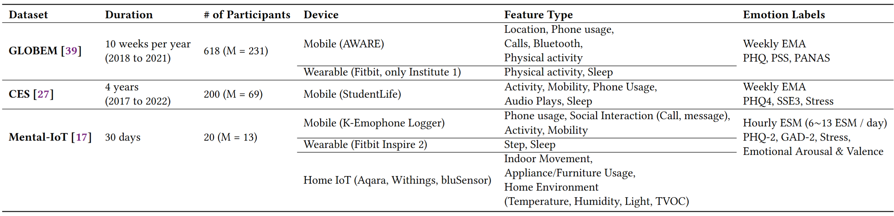
  <p><i>Figure: Dataset Descrption</i></p>
</div>

### Context Dimensions Explored

#### 1. Sensor-to-Text Representation

We compare three representation formats on GLOBEM dataset:

- **COMPass** (Ours): Statistical + structural + temporal features with natural language descriptions (adapted from SensorLM)
- **Health-LLM**: Statistical summaries (mean, std, min, max)
- **From Classification to Clinical Insights**: Markdown table format with daily aggregated values

#### 2. In-Context Learning Strategies

<div align="center">
  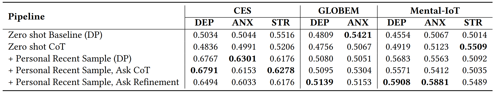
  <p><i>Figure: Comparison of ICL strategies and their impact on performance</i></p>
</div>

- **Zero-shot**: No examples provided
- **Cross-Random**: Random examples from other users
- **Cross-Retrieval**: TimeRAG-based DTW retrieval from other users (see [Supplementary](SUPPLEMENTARY.md#cross-retrieval-method))
- **Personal-Recent**: Recent historical examples from the same user
- **Hybrid**: Combination of cross-user random + personal history

#### 3. Reasoning Methods

- **Direct Prediction (DP)**: Single-step classification
- **Chain-of-Thought (CoT)**: Step-by-step reasoning
- **Self-Refinement (SR)**: Iterative critique-and-revise process

---

## 📊 Results

### Performance by Dataset and Strategy

Our experiments evaluate 4 LLM models (GPT-4o, Claude Sonnet 4.5, Gemini 2.5 Pro, and an open-source 20B model) across multiple configurations. Below are comprehensive results for each dataset:

#### GLOBEM (Multi-Institution)

<div align="center">
  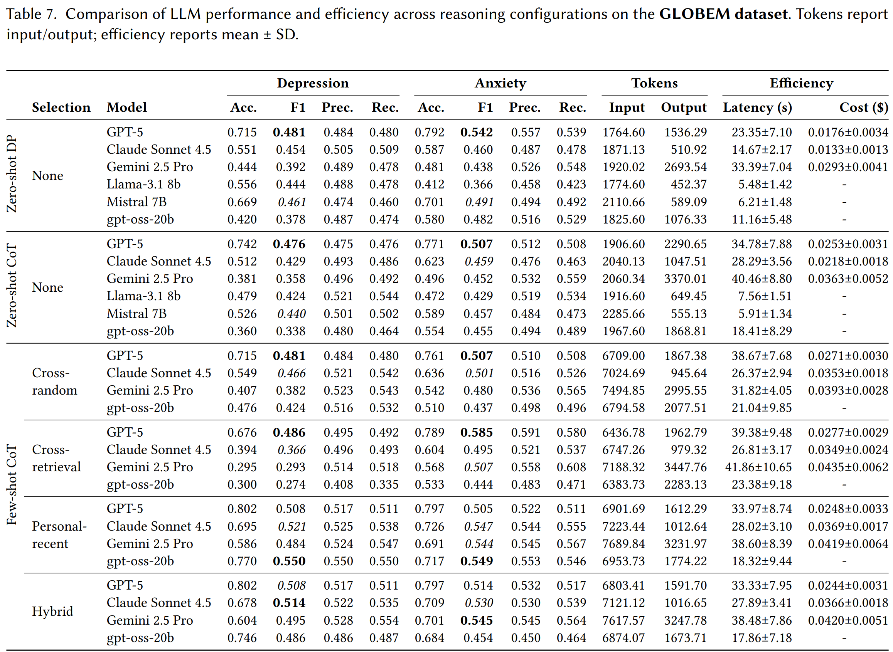
  <p><i>Table 7: Performance comparison across ICL strategies and reasoning methods on GLOBEM dataset</i></p>
</div>

**Key Findings**:
- **Hybrid-Blend + CoT** achieves best overall performance: 80.2% accuracy (depression), 79.7% accuracy (anxiety)
- Personal history (Personal-Recent, Hybrid-Blend) consistently outperforms cross-user strategies by 8-12% F1
- Zero-shot Direct offers fastest inference (14.7s) at minimal cost ($0.013), suitable for resource-constrained scenarios

#### CES (College Students)

<div align="center">
  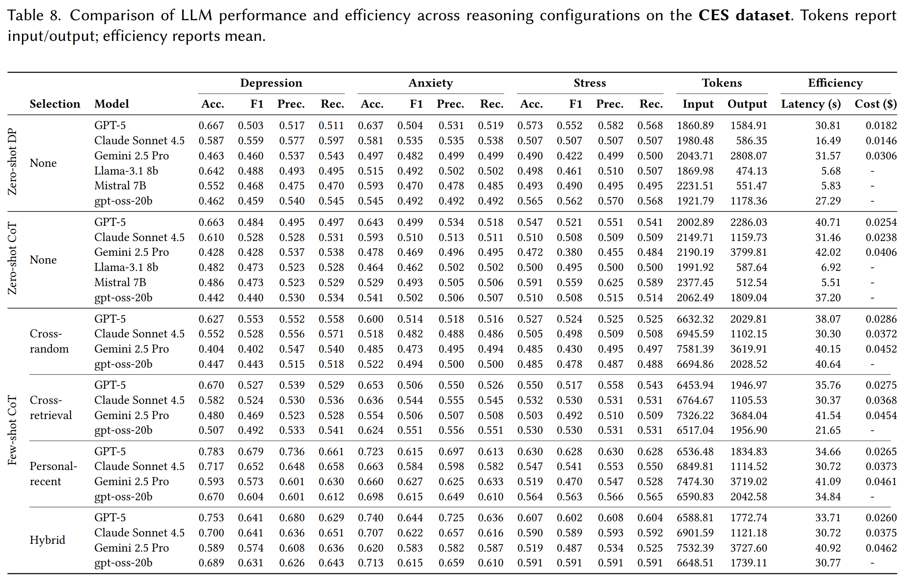
  <p><i>Table 8: Performance comparison across ICL strategies and reasoning methods on CES dataset</i></p>
</div>

**Key Findings**:
- **Personal-Recent + CoT** achieves highest depression prediction: 78.3% accuracy, 67.9% F1
- **Hybrid-Blend + CoT** shows best anxiety prediction: 74.0% accuracy, 64.4% F1
- CES benefits most from personalization, with 10-15% improvement over cross-user strategies

#### Mental-IoT (General Population)

<div align="center">
  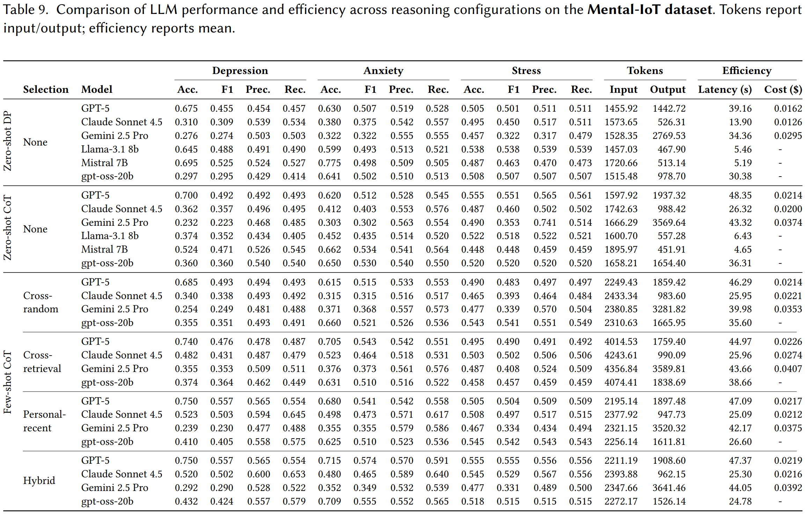
  <p><i>Table 9: Performance comparison across ICL strategies and reasoning methods on Mental-IoT dataset</i></p>
</div>

**Key Findings**:
- Lower overall performance due to higher data sparsity and shorter observation windows
- **Hybrid-Blend + CoT** shows marginal improvements over zero-shot baseline
- Stress prediction (52.3% accuracy) more stable than depression/anxiety, suggesting different feature dependencies

### Reasoning Comparison

<div align="center">
  
  <p><i>Table 5: Reasoning Performance (Macro F1 Score)</i></p>
</div>

> See [Supplementary Materials](SUPPLEMENTARY.md#self-refinement-analysis) for detailed implementation notes and usage guidelines for self-refinement.

### Performance vs. Efficiency Analysis

<div align="center">
  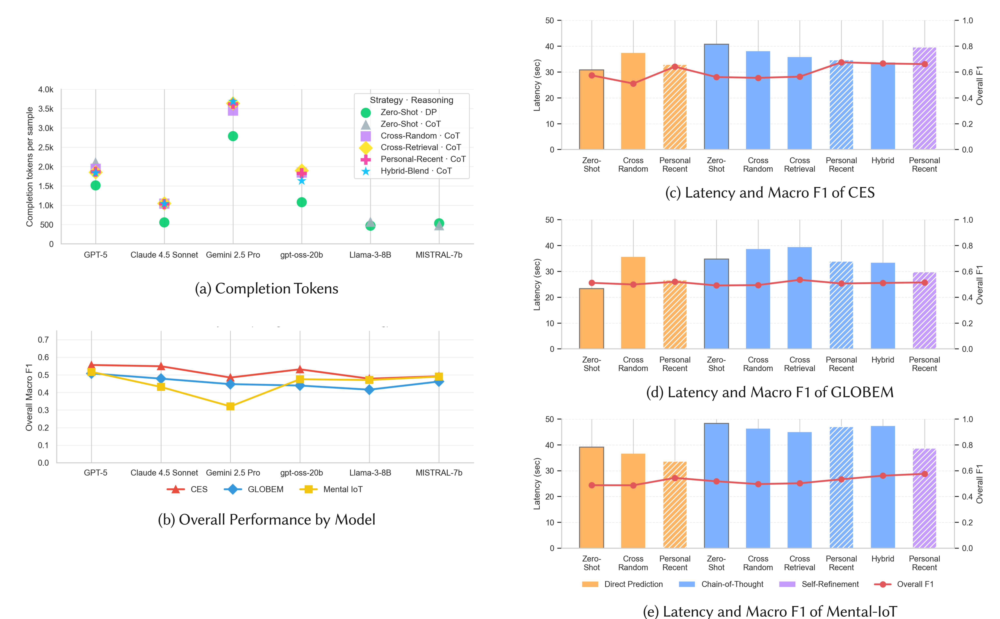
  <p><i>Figure: Performance and efficiency comparison across ICL strategies and reasoning methods.</i></p>
</div>

**Key Takeaways**:
- **Context Quality Matters**: Personal-Recent and Hybrid-Blend achieve **higher accuracy (78-80%)** while being **more efficient** (33-35s latency) compared to cross-user strategies (38-40s)
- **Better Context = Better Efficiency**: Contrary to typical trade-offs, providing relevant personal context improves both performance and speed by reducing reasoning complexity
- **Zero-shot Direct**: Minimal accuracy (55-67%) but fastest inference (~15s) and lowest cost (~$0.013) for resource-constrained scenarios
- **Recommended Default**: Personal-Recent + CoT offers best overall results for personalized mental health applications

---

## 🚀 Getting Started

### Prerequisites

- Python 3.9+
- API keys for at least one LLM provider:
  - OpenAI (GPT models)
  - Anthropic (Claude) via OpenRouter *(optional)*
  - Google (Gemini) *(optional)*
  - Ollama for local models *(optional)*

### Installation

1. **Clone the repository**

```bash
git clone https://github.com/YOUR_USERNAME/compass-sensor-llm-mh-prediction.git
cd compass-sensor-llm-mh-prediction
```

2. **Install dependencies**

```bash
pip install -r requirements.txt
```

3. **Set up API keys**

Create `src/api_keys.json` with your API credentials:

```json
{
  "openai_api_key": "sk-...",
  "openrouter_api_key": "sk-or-v1-..."
}
```

> **Note**: Only include keys for providers you intend to use. The system will automatically detect available providers.

4. **Configure dataset paths**

Edit `src/config.py` to point to your dataset locations:

```python
GLOBEM_BASE_PATH = '../dataset/Globem'
CES_BASE_PATH = '../dataset/CES'
# ... set DATASET_TYPE to 'globem', 'ces', or 'mentaliot'
```

---

## 💻 Usage

### Quick Start

Run a single prediction with default settings (4-shot Hybrid ICL + CoT):

```bash
python run_evaluation.py --mode single --verbose
```

### Batch Evaluation

Evaluate on 30 samples with stratified sampling:

```bash
python run_evaluation.py --mode batch --n_samples 30 --seed 42
```

### Configuration Options

#### ICL Strategies

```bash
# Zero-shot (no examples)
python run_evaluation.py --strategy none --n_shot 0

# Cross-random (random examples from other users)
python run_evaluation.py --strategy cross_random --n_shot 4

# Cross-retrieval (DTW-based retrieval from other users)
python run_evaluation.py --strategy cross_retrieval --n_shot 4

# Personal-recent (recent examples from same user)
python run_evaluation.py --strategy personal_recent --n_shot 4

# Hybrid-blend (mix of cross-retrieval + personal)
python run_evaluation.py --strategy hybrid_blend --n_shot 4
```

**ICL Selection Formulas**:

For **Cross-Retrieval** and **Hybrid-Blend**, we use TimeRAG-accelerated DTW:

$$
\text{DTW}(X, Y) = \min_{\pi} \sqrt{\sum_{(i,j) \in \pi} \|X_i - Y_j\|^2}
$$

where \( X, Y \) are normalized time series. See [Supplementary](SUPPLEMENTARY.md#cross-retrieval-method) for the full algorithm.

For **Hybrid-Blend**, we combine sources:

$$
\mathcal{S}_{\text{hybrid}} = \mathcal{S}_{\text{cross}}^{k/2} \cup \mathcal{S}_{\text{personal}}^{k/2}
$$

#### Reasoning Methods

```bash
# Direct prediction (fastest)
python run_evaluation.py --reasoning direct

# Chain-of-Thought (recommended)
python run_evaluation.py --reasoning cot

# Self-refinement (iterative improvement)
python run_evaluation.py --reasoning self_feedback
```

#### Model Selection

```bash
# GPT-4o (default, best performance)
python run_evaluation.py --model gpt-5

# Claude Sonnet 4.5
python run_evaluation.py --model claude-4.5-sonnet

# Gemini 2.5 Pro
python run_evaluation.py --model gemini-2.5-pro

# Open-source 20B model
python run_evaluation.py --model gpt-oss-20b
```

#### Advanced Options

**Save prompts for later reuse** (useful for comparing models with identical inputs):

```bash
# Generate and save prompts
python run_evaluation.py --mode batch --n_samples 100 --save-prompts

# Reuse saved prompts with different model
python run_evaluation.py --mode batch --load-prompts EXP_NAME --model claude-4.5-sonnet
```

**Checkpointing for long experiments**:

```bash
# Save checkpoint every 10 samples
python run_evaluation.py --mode batch --n_samples 200 --checkpoint-every 10

# Resume from checkpoint
python run_evaluation.py --mode batch --resume-from results/checkpoint_050.json
```

**Prompt-only mode** (generate prompts without calling LLM):

```bash
python run_evaluation.py --mode batch --save-prompts-only --n_samples 500
```

### Configuration Files

The system uses YAML and JSON configurations in the `config/` directory:

- **`prompt_configs.yaml`**: Prompt templates and experimental presets
- **`globem_use_cols.json`**: Feature selection for GLOBEM dataset
- **`ces_use_cols.json`**: Feature selection for CES dataset  
- **`mentaliot_use_cols.json`**: Feature selection for Mental-IoT dataset

You can modify `src/config.py` to adjust:
- Dataset selection (`DATASET_TYPE`)
- Feature aggregation windows (`AGGREGATION_WINDOW_DAYS`)
- ICL parameters (`DEFAULT_N_SHOT`, `MIN_HISTORICAL_LABELS`)
- Model settings (`DEFAULT_MODEL`, `DEFAULT_TEMPERATURE`)

---

## 📁 Repository Structure

```
compass-sensor-llm-mh-prediction/
├── config/                          # Configuration files
│   ├── prompt_configs.yaml         # Prompt templates & presets
│   ├── globem_use_cols.json        # GLOBEM feature configuration
│   ├── ces_use_cols.json           # CES feature configuration
│   └── mentaliot_use_cols.json     # Mental-IoT feature configuration
│
├── src/                             # Source code
│   ├── config.py                   # Central configuration constants
│   ├── sensor_transformation.py    # Data loading & preprocessing
│   ├── data_utils.py               # Test set sampling utilities
│   ├── prompt_manager.py           # Prompt construction from YAML
│   ├── example_selection.py        # ICL example selection strategies
│   ├── timerag_retrieval.py        # TimeRAG-accelerated DTW retrieval
│   ├── reasoning.py                # LLM reasoning methods (CoT, SR, etc.)
│   ├── llm_client.py               # Multi-provider LLM API wrapper
│   ├── evaluation_runner.py        # Batch evaluation orchestration
│   ├── performance.py              # Metrics calculation & reporting
│   └── api_keys.json               # API credentials (not in git)
│
├── assets/                          # Figures and visualizations
│
├── results/                         # Evaluation outputs
│   └── [experiment_results].json   # Per-experiment result files
│
├── saved_prompts/                   # Cached prompts (for reuse)
│   └── [experiment_name]/          # Organized by configuration
│
├── run_evaluation.py                # Main entry point
├── requirements.txt                 # Python dependencies
├── experiment_summary.csv           # Aggregated results across experiments
├── README.md                        # This file
└── SUPPLEMENTARY.md                 # Detailed supplementary materials
```

---

## 📚 Supplementary Materials


### 🎨 Prompt Visualizations

#### Full Prompt Structure

Below is a complete example of how prompts are constructed for mental health prediction tasks, showing the integration of system instructions, ICL examples, and reasoning guidance:

<div align="center">
  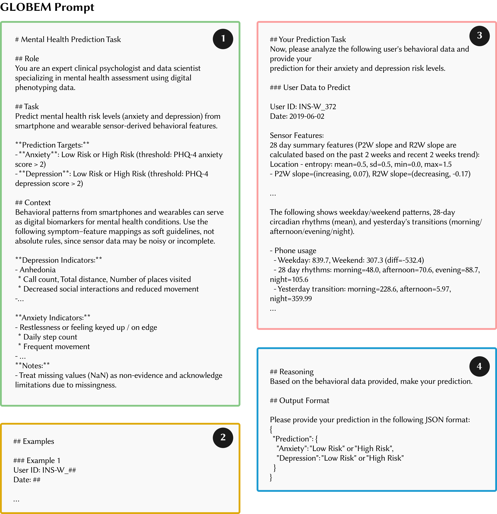
  <p><i>Figure: Complete prompt structure showing system instructions, feature descriptions, ICL examples, and task specification</i></p>
</div>

#### Reasoning Strategy - Prompt

Different reasoning methods guide the LLM's cognitive process in distinct ways:

**Direct Prediction (DP)**

<div align="center">
  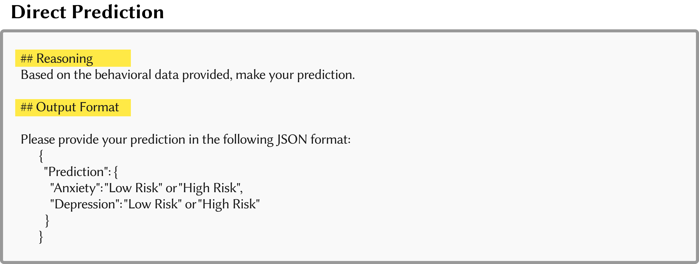
  <p><i>Figure: Direct prediction prompt - single-step classification without intermediate reasoning</i></p>
</div>

**Chain-of-Thought (CoT)**

<div align="center">
  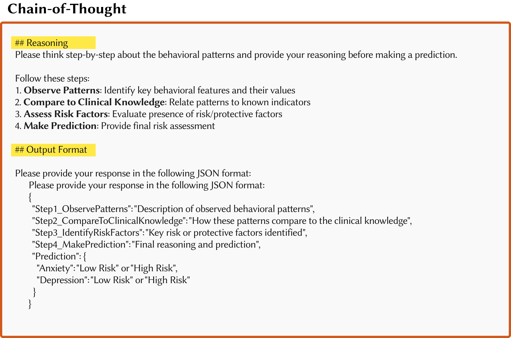
  <p><i>Figure: Chain-of-Thought prompt - structured step-by-step reasoning process</i></p>
</div>

**Self-Refinement (SR)**

<div align="center">
  
- **Initial Prediction**:
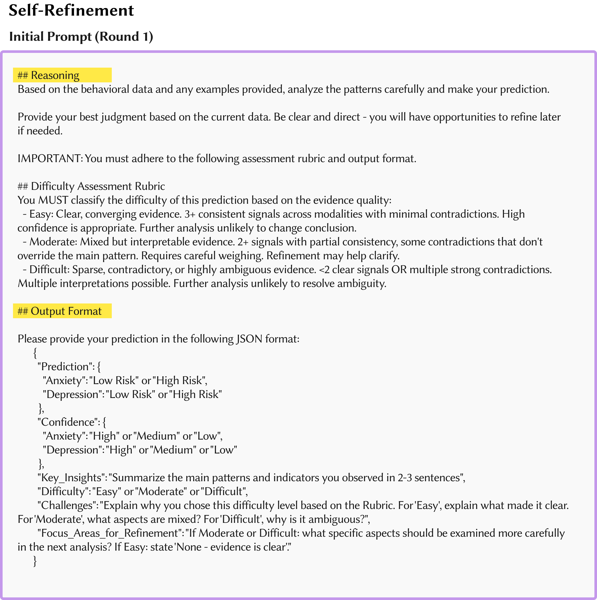
<p><i>Figure: Self-refinement initial prediction phase</i></p>

- **Critique & Refinement**:
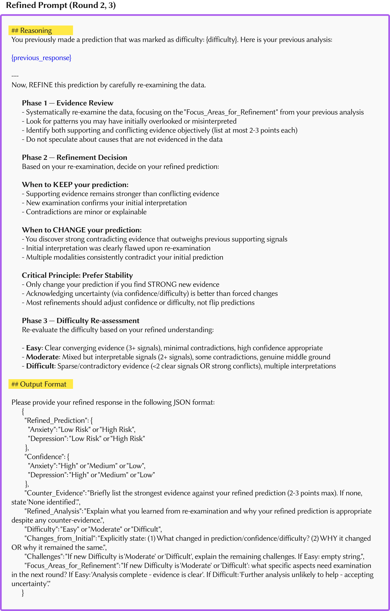
<p><i>Figure: Self-refinement critique and revision phase</i></p>

</div>

---

### 🔍 Cross-Retrieval Method (TimeRAG)

For Cross-Retrieval and Hybrid-Blend ICL strategies, we implement an efficient retrieval system based on **TimeRAG** (Time-series Retrieval Augmented Generation). This approach combines:

Our retrieval pipeline consists of three main steps:

**Step 1: Clustering** — Reduce training set from N samples to M=300 representatives using K-Means clustering

**Step 2: DTW Ranking** — Compute DTW distance between target and each representative, retrieve top-(k×α) candidates

**Step 3: Label Stratification** — Balance selected examples across outcome classes (anxiety × depression)

```
Input: Training data D, target series T, k examples
Output: k balanced ICL examples

1. Cluster D into M=300 groups, select centroid-nearest from each
2. Compute DTW(T, representative) for all M representatives  
3. Retrieve top-(k×2) by DTW distance
4. Select k examples with balanced labels (stratified sampling)
```

---

### Quick Links to Visualizations

<div align="center">

| GLOBEM ICL | CES ICL | Mental-IoT ICL |
|:----------:|:-------:|:--------------:|
|  |  |  |

</div>

---


### Dataset Citations

- **GLOBEM**: [Link to GLOBEM paper]
- **CES**: [Link to CES paper]
- **Mental-IoT**: [Link to Mental-IoT paper]


---

<div align="center">

**🧭 COMPass: Because context is everything.**

</div>
